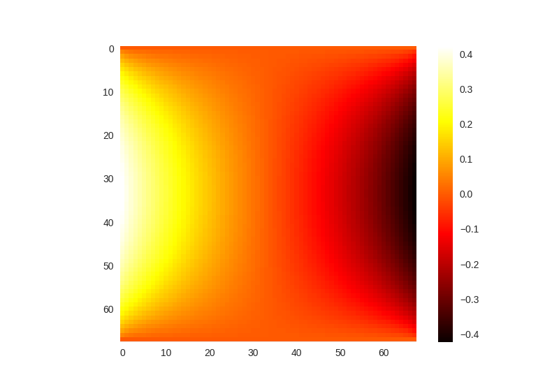
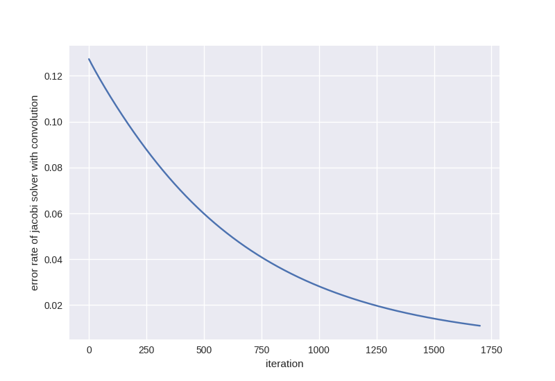

1. convolution with special boundary treatment is equvlent

2. feed forward Jacobi network is converging, but slow

3. parameter estimation requires very deep network
ground truth -> 16.0
400 layers -> 8.1
1500 layers -> 14.3
This is caused by the error in network prediction/ slow convergence v.s. network depth

